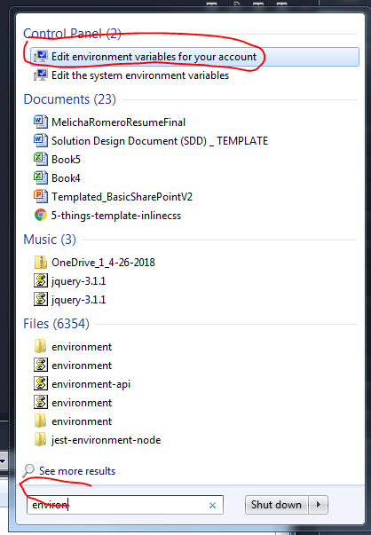
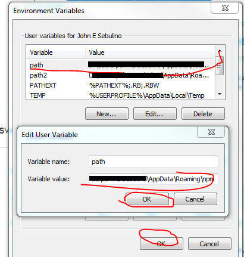
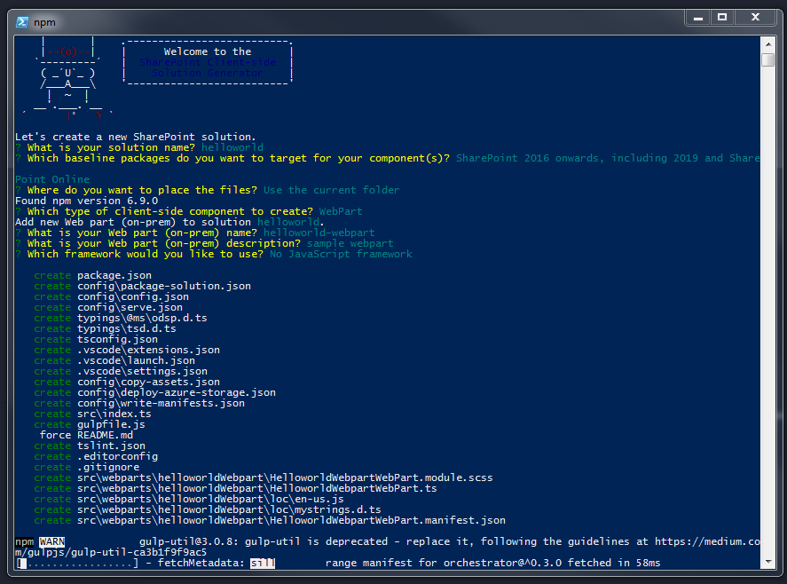

# SharePoint-Framework

SharePoint Framework Getting Started

Most steps here can be found in : [Official MS Documentation](https://docs.microsoft.com/en-us/sharepoint/dev/spfx/set-up-your-development-environment)

## Requirements

- NodeJS ( PC Installation - Admin Support needed)
- NPM (Installed with NodeJS)
- Yeoman ( Installed via npm )

## Setting up Development Enviroment for SharePoint Framework Development

---

### Install [Yeoman](https://yeoman.io) and [gulp](https://gulpjs.com/)

```js

npm install -g yo gulp

```

---

### Try Yeoman in your console (cmd or WindowsPowerShell)

```cmd
yo -v
```

If you get an error: "yo" is not recognized as an internal or external command, operable program or batch file.

Get the npm AppData Path by running (WinKey + R) : %APPDATA%\npm
It should give you the location, copy the path : It will look like this: 'D:\Users\John E Sebulino\AppData\Roaming\npm'

Then Search for : "Environment Variable" and click it



Click "path", edit, Enter the path you get earlier ('D:\Users\John E Sebulino\AppData\Roaming\npm') then 'ok'



Restart your console (wps or cmd);

---

### Install Yeoman SharePoint generator

```
npm install -g @microsoft/generator-sharepoint
```

---

---

### Trust the self-signed developer certificate

```sh
gulp trust-dev-cert
```

---

## Getting Started with First Sample Webpart

Refer to [this tutorial](https://www.youtube.com/watch?v=S3tG2DE8tR8).

Run

```
    yo @microsoft/sharepoint
```



Installation of scaffolding will take some time.

## Run `gulp serve` in your console to start local workbench

Local Workbench - for testing locally

## If the workbench doesn't run or you can't access it on your browser.

Modify confg/serve.json and set https: false for the meantime

## Access Online Workbench

Sample: https://yoursharepointsite.com/_layouts/15/workbench.aspx

## Run `gulp package-solution`
