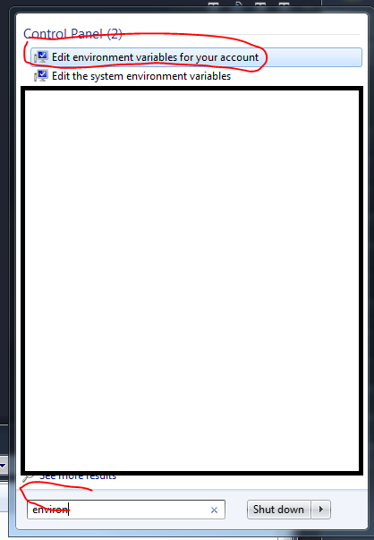

# SharePoint-Framework

SharePoint Framework Getting Started

## Requirements

- NodeJS ( PC Installation - Admin Support needed)
- NPM (Installed with NodeJS)
- Yeoman ( Installed via npm )

### Install Yeoman

```js

npm install -g yo

```

### Try Yeoman in your console (cmd or WindowsPowerShell)

```cmd
yo -v
```

If you get an error: "yo" is not recognized as an internal or external command, operable program or batch file.

Get the npm AppData Path by running (WinKey + R) : %APPDATA%\npm
It should give you the location, copy the path : It will look like this: 'D:\Users\John E Sebulino\AppData\Roaming\npm'

Then Search for : "Environmen Variable" and click it


